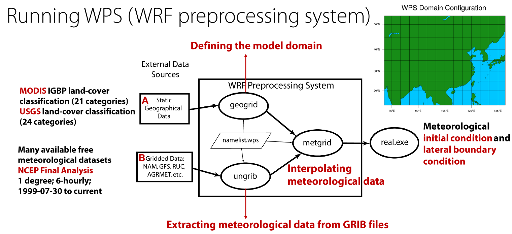
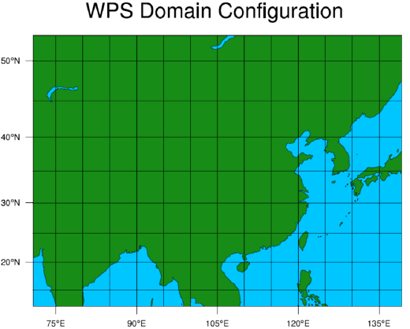

Domain, meteorology, and configuration
======================================

.. warning::
	Coming soon - please refer to the PDF User's Guide for this section for now.

This section discusses:

* Setting up the domain using WPS's ``geogrid.exe`` tool.
* Processing the meteorological initial and boundary conditions by downloading, running WPS's ``ungrib.exe``, and ``metgrid.exe``.
* Basic configuration of WRF-GC using the ``namelist.input``.
* Using WRF's ``real.exe`` to prepare input before adding in chemical initial/boundary conditions.

.. note::
	The WRF Pre-Processor can be learned best from the `WRF User's Guide <https://www2.mmm.ucar.edu/wrf/users/docs/user_guide_V3/user_guide_V3.9/users_guide_chap3.html>`_ , as this is not specific to chemistry.

An overview of the workflow of the WRF Pre-Processor system (by Xu Feng):

The data in "A" is described in :ref:`wps-input-data`. The data in "B" is described below in "Downloading meteorological data".

Setting up the domain using GEOGRID
-------------------------------------

Configuration of the WPS is done in ``namelist.wps`` file under the ``WPS`` directory.

The first step is to describe your simulation domain. Example entries for the ``namelist.wps`` file's ``&share`` and ``&geogrid`` sections are below:

.. code-block::

	&share
	 wrf_core = 'ARW',
	 max_dom = 1,
	 start_date = '2016-06-27_00:00:00',
	 end_date   = '2016-06-29_00:00:00',
	 interval_seconds = 21600
	 io_form_geogrid = 2,
	 debug_level = 1,
	/

	&geogrid
	 parent_id         =   1,
	 parent_grid_ratio =   1,
	 i_parent_start    =   1,
	 j_parent_start    =   1,
	 e_we = 245,
	 e_sn = 181,

	 geog_data_res = 'default', 'default',
	 dx        = 27000,
	 dy        = 27000,
	 map_proj  = 'mercator',
	 ref_lat   = 27,
	 ref_lon   = 105,
	 truelat1  = 27.0,
	 stand_lon = 105,
	 geog_data_path = '/n/seasasfs02/hplin/geog'
	/

The configuration options you need to change with a brief description are listed below. This will get you up and running fast, but we recommend checking out the WPS user's guide.

* ``max_dom``: Number of domains. 1 = single domain, up to 8 are supported when working with nested domains. We do not discuss multiple domains here for simplicity.
* ``start_date`` (per-domain): Start date of simulation
* ``end_date`` (per-domain): End date of simulation
* ``e_we`` and ``e_sn``: Dimensions of the grid in x/y dimensions.
* ``dx`` and ``dy``: Grid distance in the x/y dimensions where the map scale factor is 1. In meters when ``map_proj = 'mercator'``, in degrees when ``map_proj = 'lat-lon'``.
* ``map_proj``: Map projection. **Only mercator and lat-lon (unrotated regular latitude-longitude) are supported currently in WRF-GC.**
* ``ref_lat``, ``ref_lon``, ``truelat1``, ``stand_lon`` etc. are grid location parameters (where your regional grid is located in). Refer to the WRF User's Guide.
* ``geog_data_path``: Path to the static WPS input data you downloaded in the previous steps.

Once ``namelist.wps`` is configured, you can run GEOGRID:

.. code-block::

	./geogrid.exe

This will generate ``geo_em.d01.nc`` (1 domain) and other ``geo_em.d0X.nc`` files for other domains if you are using multiple domains.

Preview the generated grid using the ``ncl`` script (requires NCL installed):

.. code-block::

	ncl util/plotgrids_new.ncl

An example is shown below:

Downloading meteorological data
--------------------------------

.. warning::
	Under construction.

Setting up Vtable
------------------

Depending on the meteorological data, the appropriate ``Vtable`` needs to be linked so the UNGRIB utility can find it.

If you are using `NCEP FNL <https://rda.ucar.edu/datasets/ds083.2/>`_ or `GFS <https://www.nco.ncep.noaa.gov/pmb/products/gfs/>`_ data, link the ``Vtable.GFS`` into WPS directory:

.. code-block::

	ln -s ungrib/Variable_Tables/Vtable.GFS Vtable

Running UNGRIB and METGRID
---------------------------

Configure UNGRIB and METGRID in ``namelist.wps``. These should be mostly unchanged:

.. code-block::
	
	&ungrib
		out_format = 'WPS',
		prefix = 'FILE',
	/

	&metgrid
		fg_name = 'FILE',
		io_form_metgrid = 2,
	/

Link GRIB files - ``./link_grib.csh gfs*`` (replace ``gfs*`` pointing to the meteorological input files you downloaded in the previous step)

Then run ``./ungrib.exe``, then ``./metgrid.exe``. You should now have meteorology data named ``met_em.d``... in the WPS directory. 

Link the meteorology from WPS to WRF
-------------------------------------

Go to the **WRF run directory** - ``WRF/run``. Link the meteorological data into the run directory:

.. code-block::

	ln -sf ../../WPS/met_em* .

Configuring WRF-GC - ``namelist.input``
----------------------------------------

**Almost all WRF-GC configuration is performed inside namelist.input.** This namelist, located in the WRF run directory, controls most aspects of the simulation.

.. warning::
	Not all options in WRF for dynamics and physics are supported in WRF-GC! This is because to couple WRF to GEOS-Chem, the internal quantities need to be translated to GEOS-Chem's meteorology format (based on GEOS-FP).

	The list of supported schemes is available in `Lin et al., 2020 <https://gmd.copernicus.org/articles/13/3241/2020/>`_:

	.. image:: images/WRF_supported_options_Lin2020.png
       :width: 600

We do not discuss WRF configuration options in detail here and invite you to refer to the WRF User's Guide. The basic options to change in ``namelist.input`` are:

&time_control
^^^^^^^^^^^^^

* Configure the length of your run in ``run_days/hours/minutes/seconds``, ``start_year/month/day/hour/minute/second``, etc.
* **Configure output frequency.** Use ``history_interval`` (in minutes). e.g., hourly output - ``history_interval = 60``.
* **Configure frames per output netCDF file.** e.g., ``frames_per_outfile = 2`` with ``history_interval = 60`` means 2 hours will be written per file.
* **Restarts.** If this is a restart run (running from existing ``wrfrst_d<domain>_<date>`` file), set ``restart = .true.``. By default should be set to ``.false.``.
* **Write out restart files.** Set ``restart_interval`` (in minutes).

&physics
^^^^^^^^

* **Microphysics scheme.** (``mp_physics``): We recommend the Morrison Double-Moment scheme (``mp_physics = 10``).
* **Cumulus parameterization scheme.** (``cu_physics``): We recommend New-Tiedke scheme (``cu_physics = 16``).

&chem
^^^^^

Configuration of chemistry is within the ``&chem`` section.

**For WRF-GC chemistry,** set ``chem_opt = 233``.

You can control individual processes in GEOS-Chem using:

* Convection: ``gc_do_convection``
* Emissions: ``gc_do_hemco``
* Turbulence / Boundary layer mixing: ``gc_do_pblmix``
* Chemistry: ``gc_do_chemistry``
* Dry deposition: ``gc_do_drydep``
* Wet deposition: ``gc_do_wetdep``.

By setting these switches to ``0`` (off) or ``1`` (on).

To configure some simple GEOS-Chem diagnostics, add options to ``&chem`` following the guide in :doc:`/extra-diagnostics`.

Configuring WRF-GC - ``input.geos``
------------------------------------

**Most** input.geos options known by GEOS-Chem users are not configured in input.geos in WRF-GC, and are instead controlled by ``namelist.input``. Only two exceptions: the path to ``CHEM_INPUTS`` needs to be specified in:

.. code-block::
	
	Root data directory     : /n/holyscratch01/external_repos/GEOS-CHEM/gcgrid/data/ExtData/

and

.. code-block::

	%%% PHOTOLYSIS MENU %%% :
	FAST-JX directory       : /n/holyscratch01/external_repos/GEOS-CHEM/gcgrid/data/ExtData/CHEM_INPUTS/FAST_JX/v2021-10/

**Most other options in input.geos for WRF-GC are ignored.**

Configuring WRF-GC - emissions in ``HEMCO_Config.rc``
------------------------------------------------------

Configuration of HEMCO is exactly the same as the GEOS-Chem model. Remember to update the HEMCO data path in this configuration file:

.. code-block::

	ROOT:                        /n/holyscratch01/external_repos/GEOS-CHEM/gcgrid/data/ExtData/HEMCO

.. note::
	A reminder about ``input.geos``, ``HEMCO_Config.rc``, and ``namelist.input`` configuration files - **these files are replaced every time the WRF model is recompiled** (when ``./compile em_real`` is ran). **Please remember to back up your configuration files!**

Running ``real.exe``
---------------------

After configuring, run ``real.exe``. This is a memory and compute intensive operation - if you are on a cluster, you will need to submit a batch job like you would do when running other models. Otherwise, run

.. code-block::

	mpirun -np 32 ./real.exe

Where "32" would be the number of cores. The output can be watched by ``tail -f rsl.out.0000`` and any errors would be in ``rsl.error.0000``.

After running ``real.exe``, the initial condition file ``wrfinput_d<domain>`` and boundary condition file(s) ``wrfbdy_d<domain>`` are generated.